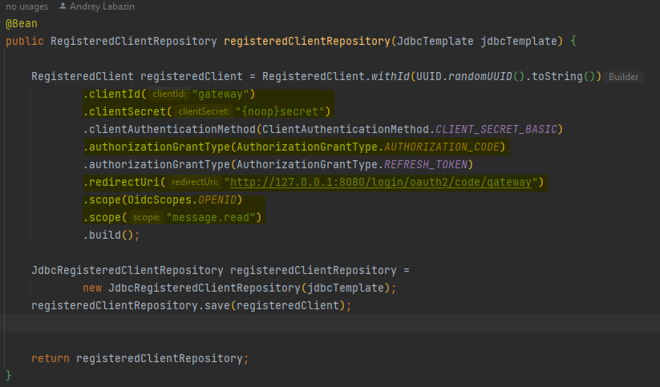

# Spring Gateway

## Конфигурация

### Server
В поле `server` указан порт, на котором будет работать приложение - `8080`.

### Spring Cloud Gateway Routes
В поле `spring.cloud.gateway.routes` описаны маршруты в шлюзе.

В данном проекте уже настроен один маршрут:
-  `client-service`  - маршрут на клиентский сервис

Маршрут `resources` перенаправляет запросы, соответствующие предикату `Path=/message/**` на урл `http://127.0.0.1:8090/message`.

Маршрут `client-backend` перенаправляет запросы, соответствующие предикату `Path=/resource/**` на урл `http://127.0.0.1:8090/resource`. 
Для этих запросов заданы фильтры `TokenRelay=` и `RemoveRequestHeader=Cookie`.
1.  `TokenRelay=` : Этот фильтр используется для передачи токена аутентификации через данный API-шлюз от входящего запроса к исходящему запросу.

2.  `RemoveRequestHeader=Cookie` : Этот фильтр используется для удаления заголовка 'Cookie' из входящего HTTP-запроса перед его перенаправлением на внутренний сервис. 
Это нужно, чтобы другие сервисы не видели или не использовали куки клиента (опционально)

### Spring Security OAuth2 Client
В секции `spring.security.oauth2.client` описан клиент oauth2. Значения должны совпадать с данными зарегистрированного пользователя на сервере авторизации.

В `registration.gateway` указаны параметры регистрации клиента:
- `provider: spring` - поставщик аутентификации, типа keycloak, spring и т.д.
- `client-id: gateway` и `client-secret: secret` - идентификатор и секрет клиента
- `authorization-grant-type: authorization_code` - тип предоставления авторизации (авторизационный код)
- `redirect-uri: "http://127.0.0.1:8080/login/oauth2/code/{registrationId}"` - урл для редиректа после авторизации
- `scope: openid,message.read` - запрашиваемые scope

В `provider.spring` указан issuer-uri поставщика аутентификации - `http://localhost:9000`.

Пример создания системного пользователя для нашего случая, т.е. по сути для доверенного API-шлюза, который будет иметь полномочия на получение токенов авторизации. 
Настраивается на сервере авторизации:

